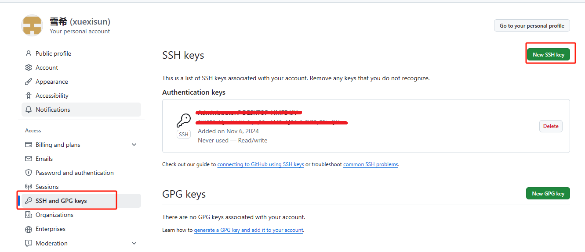
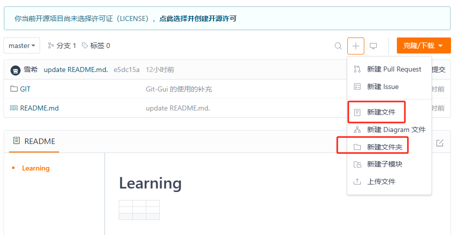
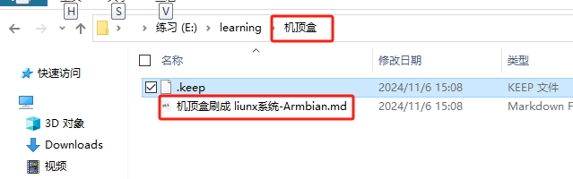

# Git-Gui 的使用

## 汉化

1. 下载汉化文件 https://files.cnblogs.com/files/chenghu/git-gui-zh-master.zip

2. 找到 git 安装路径 ( 我的安装位置在 D:\Program Files\Git\mingw64\share\git-gui\lib\msgs), msgs 可能不存在, 需要手动自己创建.

3. 

4. 解压下载的文件, 将名为 zh_cn.msg 的文件, 放进 msgs 中文件夹中

   

5. 重新打开Git GUI 如下图: 

   


## 权限校验

生成公钥

1. 点击菜单栏 帮助 - 显示ssh密钥

   

2. 然后再点击 生成密钥 然后 复制到粘贴板


3. GitHud 与 Gitee 添加 SSH 密钥  ( 添加SSH公钥的页面都在设置里 ), 且保存后前都要输用户密码

   -  GitHud  的教程 [通过 SSH 连接到 GitHub - GitHub 文档](https://docs.github.com/zh/authentication/connecting-to-github-with-ssh)
   -  Gitee  的教程 [SSH 公钥设置 | Gitee 帮助中心](https://help.gitee.com/base/account/SSH公钥设置)

   

   

   

4. 测试 SSH 连接 (第一次执行 ssh 的命令会有警告信息, 直接输入yes 按回车即可)

```sh
# Gitee
ssh -T git@gitee.com

# Github
ssh -T git@github.com
```

5. 输出 SSH Key 绑定的用户名 即对应 远程 git 的用户名 


## git Gui 的基础操作

1. 前提准备配置个人的用户名称和电子邮件地址，克隆/下载远程仓库

   ```shell
   git config --global user.name "xuexi"
   git config --global user.email 2161224007@QQ.COM
   
   git clone https://gitee.com/sunxuexi/learning.git
   ```

   

2. 在有 .git 的目录右击 - Open Git GUI here 打开 Git GUI

   

   

3. 提交操作

   1. 点击 下方的重新扫描, 将会在 未缓存的改动 或 缓存的改动 信息显示文件信息

      

   2. 点击 下方的缓存改动, 然后点确定, 

       

   3. 此时 未缓存的改动 将会被清空, 缓存的改动 就是将要提交的内容.填写提价描述, 然后点击提交

      

   4. 最后点击上传 在弹窗选择分支,  在点击上传

      

      

   5.  下图就是上传成功, 以及Gitee 的信息

      

      

      字符乱码问题: 在缓存未提交的窗口上右击选择 编码 - Unicode(UTF 8)

      

4. 同步远程代码

   1. 准备工作: 手动在远程 git 仓库创建文件夹 (机顶盒) 和文件 (机顶盒刷成 liunx系统-Armbian.md) 

      

      添加文件夹 - 机顶盒

      

      添加文件 - 机顶盒刷成 liunx系统-Armbian.md

      

      在拓展信息内添加说明信息然后点击 提交

      

   2. 点击菜单栏 远程库 - 从...项获取 - origin(  有可能不是这个名字 )

      

   3. 如果远程仓库有东西 弹窗里面会显示一些信息

      

   4. 再点击菜单栏 合并- 本地合并

      

   5. 在空白的位置单击一下就能看到之前在的在远程仓库填写的说明信息

      

   6. 然后点击合并即可

      

   7. 看到提示信息 以及查看文件管理器的中的新内容

      

      

5. 冲突处理
   1. 准备工作: 手动在远程 git 仓库修改文件(README.md), 同时也在本地修改同名文件

      
      
      
      
      

参考来源：http://www.cnblogs.com/iruxu/p/gitgui.html