# GIT 的使用

## 基础命令

1. git config --global [user.name | user.email] [xuexi | 2161224007@QQ.COM] 设置用户签名

2. git init [目录]: 初始化一个Git仓库

3. git clone (url): 从远程仓库克隆代码到本地

4. git add [ . | 目录 | 文件]: 添加文件到暂存区

5. git reset [ . | 目录 | 文件]: 将文件从暂存区移除

6. git commit -m (记录): 将暂存区的文件提交到本地仓库

7. git mv (旧路径) (新路径): 移动或重命名文件

8. git rm (目录 | 文件): 存储库中删除文件

9. git push: 将本地仓库的代码推送到远程仓库

10. git pull: 从远程仓库拉取最新代码

11. git branch [新分支名] [-a | -r | -v] : 列出所有本地或远程分支

12. git checkout: 切换分支或恢复工作树文件

13. git merge: 合并指定分支到当前分支

14. git status: 显示工作树的状态

15. git log: 显示提交日志

16. git diff: 显示工作树与暂存区或本地仓库之间的差异

17. git stash: 将当前工作区的变更储存到一个临时区域

18. git tag: 添加. 列出或删除标签

19. git remote: 管理远程仓库

20. git fetch: 从远程仓库拉取最新代码，但不自动合并到本地仓库

    

## 使用教程

###  基础设置

1. 配置基础信息用户签名: 用户名和邮箱, 在桌面右击 - Open git Bash here  开启命令窗口.

   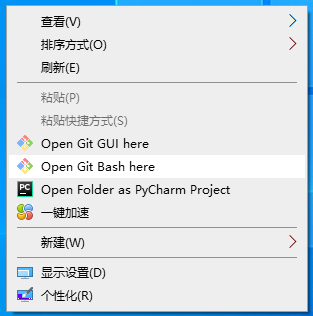

2. 设置用户名以及邮箱并查看全局配置

   ```shell
   git config --global user.name yhm
   git config --global user.email yaohm7788@163.com
   git config --list # 查看全局配置
   ```

   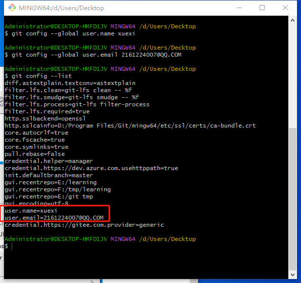

   

###  创建仓库

创建仓库有两种方式一是本地创建, 二是远程拉取.实际工作中让远程拉取的操作更多

**本地创建**

1. 本地创建: 打开文件管理器在任意一个文件夹中右击 - Open git Bash here  开启命令窗口.

   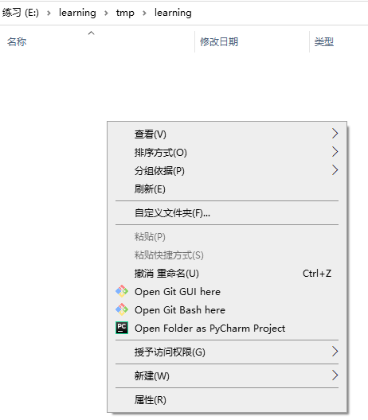

2. 初始化仓库, 此命令会在当前目录生成一个.git目录

   ```shell
   git init
   ```

   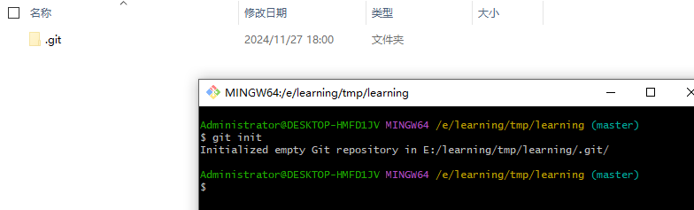

3. 当然也可以指定创建的位置\

   ```shell
   git init 'E:\learning\tmp\learning\gitdir'
   ```

   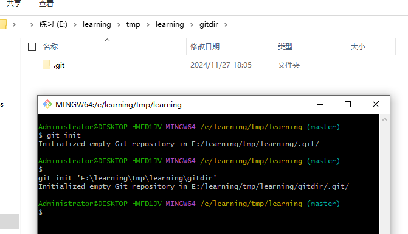

   

   **远程拉取**

   1. 远程仓库需要Gitee或GitHub. 要么自己创建一个远程仓库, 要么使用其他人或公司已有的这里使用的是自己的, 需要手动复制一下https的连接

      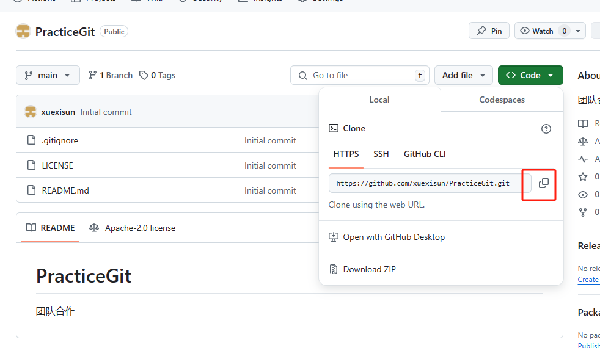

   2. 这里跟创建本地仓库是一样的, 打开文件管理器在任意一个文件夹中右击 - Open git Bash here  开启命令窗口 然后输入命令

      ```shell
      git clone https://github.com/xuexisun/PracticeGit.git
      ```

   3. GitHub有网络连接的问题, 需要提前准备一些网络环境

      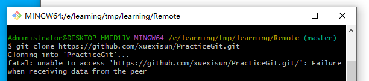

   4. 如果远程拉取成功, 会在当前文件夹创建一个与远程仓库名相同的文件名, 

      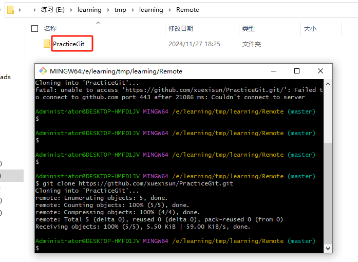

      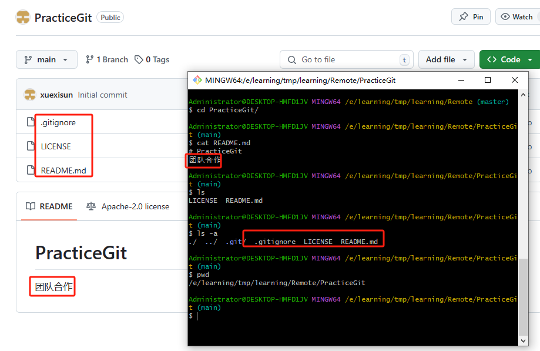
      
      

###  查看状态

1. 显示工作区和暂存区的状态, 目前没有新文件所以这里面没有显示出文件信息

   ```shell
   git status
   ```

   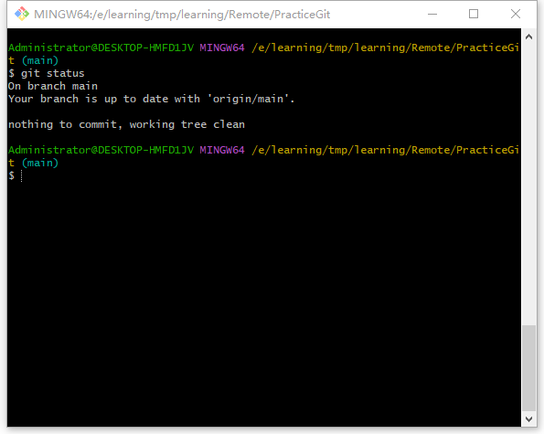

2. 颜色标识

   - 红色，未加入版本控制;
   - 绿色，已经加入版本控制暂未提交;
   - 蓝色，加入版本控制，已提交，有改动；
   - 白色，加入版本控制，已提交，无改动；
   - 灰色：版本控制已忽略文件。

### 添加新文件

将本将工作区文件提交到嗯暂存区

1. 创建新文件或者文件夹然后在命令窗口中输入以下命令

   ```shell
   git status  # 查看文件状态
   git add .   # 将所有文件加入暂存区
   git status  # 再次查看文件状态
   ```

   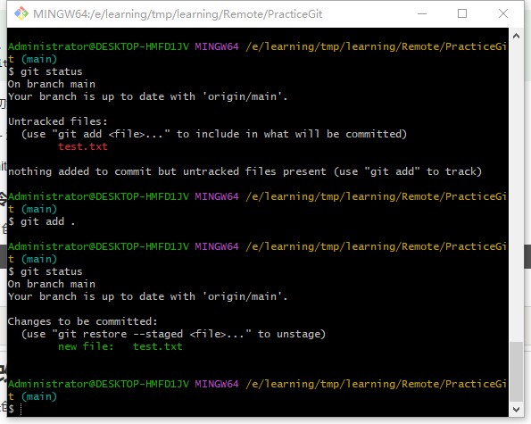

2. 意外发现空文件夹, 是不会加入到暂存区中. 而且看文件状态也无法看到


### 提交暂存区

将本地战神区的文件提交到本地库

```shell
git commit -m '第一次版本提交'
git log  # 查看提交历史
git status 
```

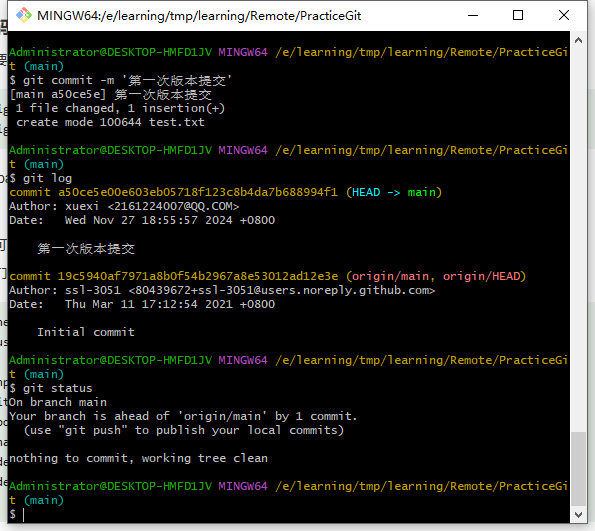


### 合并提交

1. 在修改一下刚才已经提交的文件, 在将文件加入到暂存区中

   ```shell
   git status
   git diff  # 查看暂存区和工作区的差异
   git add .
   ```

   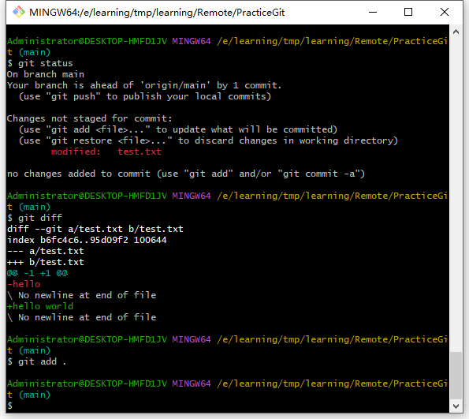

2. 

## 参考连接

[菜鸟教程 | Git 教程](https://www.runoob.com/git/git-tutorial.html)

[CSDN | git命令大全一文搞定](https://blog.csdn.net/kenan6545456/article/details/139885605)

[CSDN | git常用的命令集](https://blog.csdn.net/weixin_45102459/article/details/135149438)

[百家号 | 41个常用Git命令清单](https://baijiahao.baidu.com/s?id=1750089046854021842&wfr=spider&for=pc)

[官网文档](https://git-scm.com/docs)

