# 同步 Gitee 和 GitHup

1. 先登录Gitee 选择你要同步的远程仓库点击右上角的 管理

   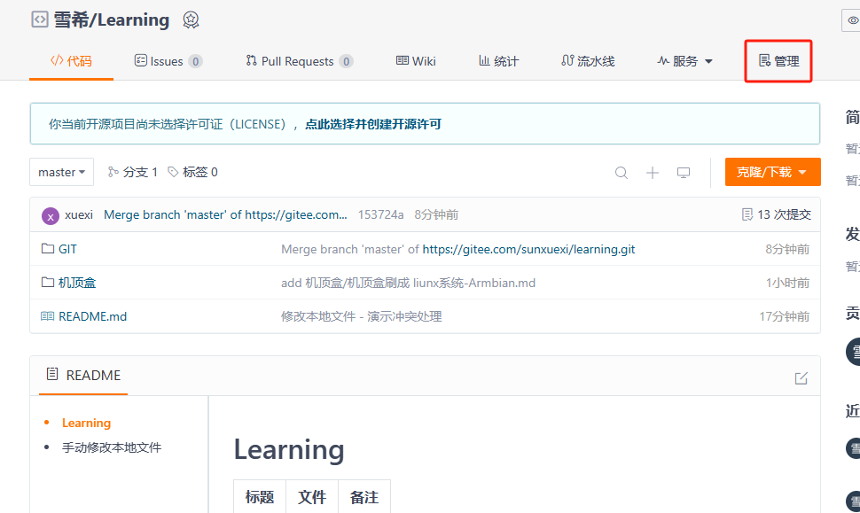

2. 点击页面左侧的 仓库镜像管理 然后再点击右上角 添加镜像

   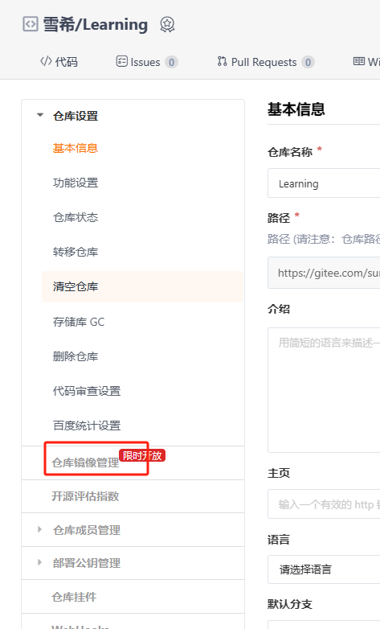

   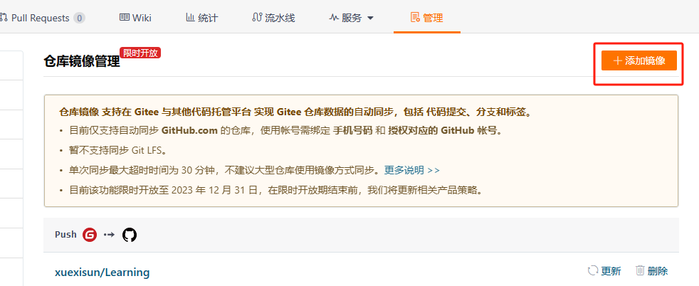
   
3. 请问授权点击 确认 之后弹出页面 输入 githup 的密码 

   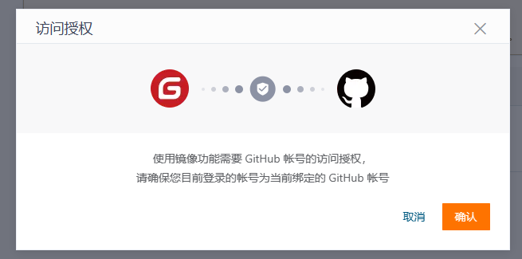

   

4. 回到授权之后回到页面, 选择镜像方向( 我这里是从Gitee同步到GitHub ), 然后要求获取私人令牌 (网页上有官网教程:[仓库镜像管理 （ Gitee <-> Github 双向同步） - Gitee.com](https://gitee.com/help/articles/4336#article-header10))

   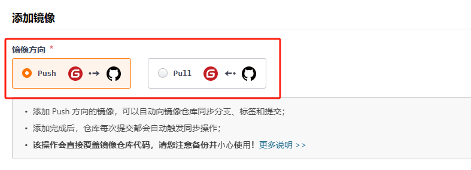

   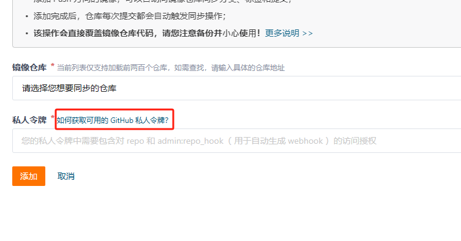

5. 登录GitHub账号然后点击右上角用户头像, 然后在下方找到 Settings

   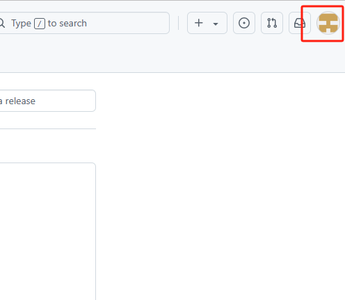

   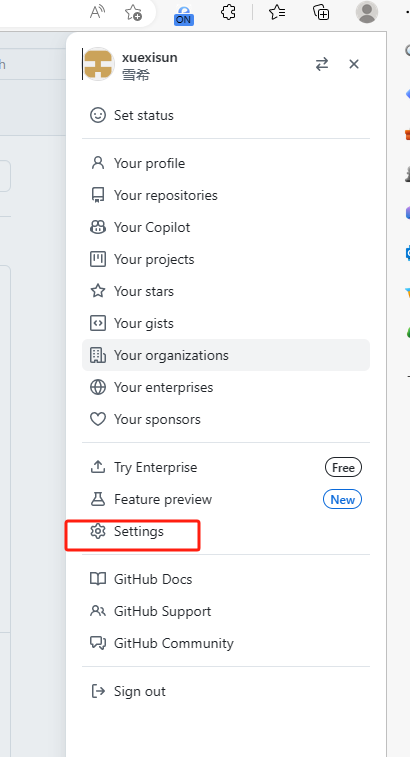

6. 在页面左侧栏的最下方找到 Developer setting

   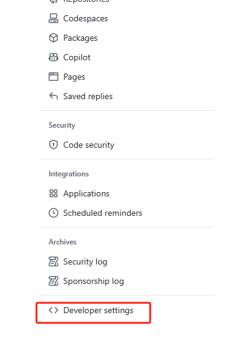

7. 在页面左侧栏选择 Personal access tokens - Tokens(classic) 选项后点击右上角的 Generate new token, 然后点击第二个选项 Generate new token (classic) 此时可能又要求输入密码

   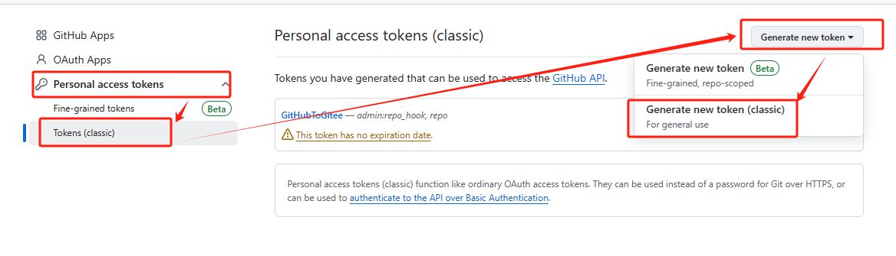

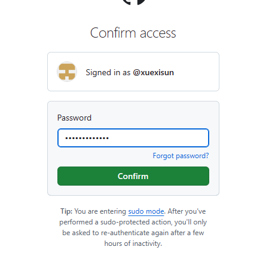

8. Note里面是输入令牌名字, 而下面是选择有效天数, 我这里选择的是无限

   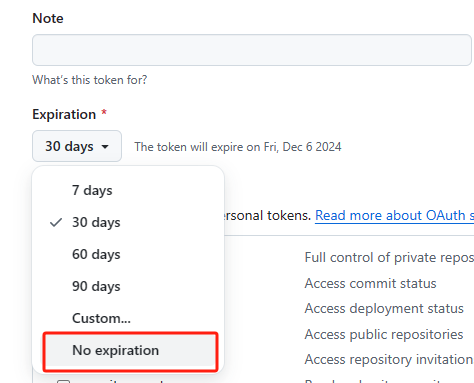

9. repo 字段为必选字段. 直接勾选, admin:repo_hook 字段为可选字段, 用于自动生成 webhook( 我也不懂资格字段的意义 )

   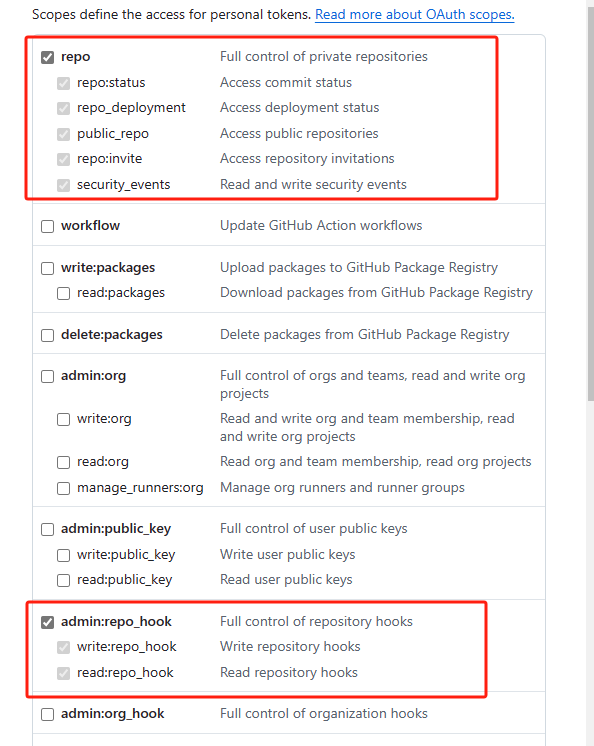

10. 滚动页面到最下方点击绿色按钮, Generate token

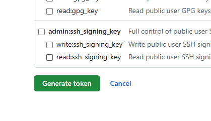

11. 点击复制按钮, 回到刚才 gitee 粘贴

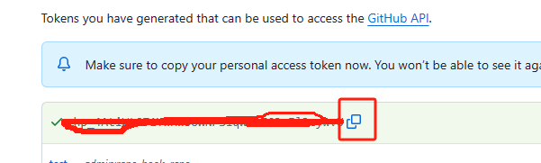

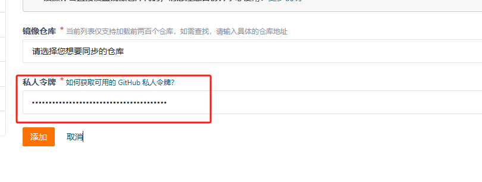

12 选择要同步的仓库 (这个仓库要提前在 GitHub上建创建出来) 最后点击添加. 

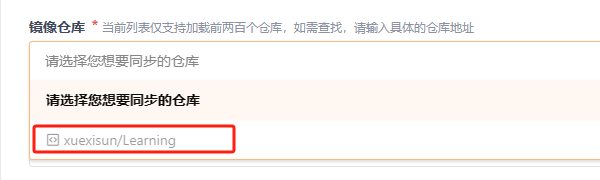

13. 回到之前的页面这里可以点击手动更新, 当然也会自动更新

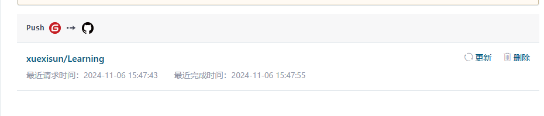

