# 升级PyCharm

## 备份配置文件

路径如下  (配置文件可以暂时备份到桌面)

```
1. 用户配置：C:\Users\[用户名]\AppData\Roaming\JetBrains\PyCharm2020*
2. 本地缓存：C:\Users\[用户名]\AppData\Local\JetBrains\PyCharm2020* (这个目录我没打算保留)
3. 系统配置：C:\ProgramData\JetBrains\PyCharm2020*（我电脑没有这个目录）
```

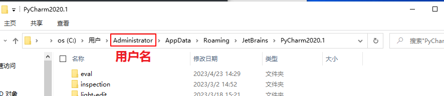

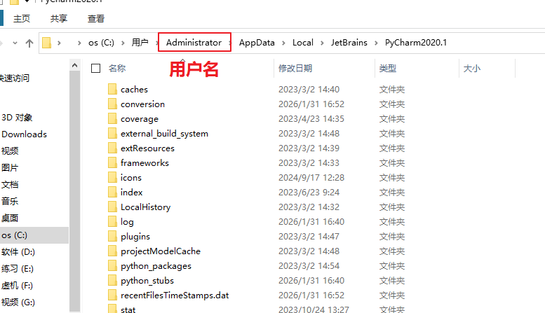

另一种备份配置的文件方法就是通过pycharm导出 点击确定之后就生成一个压缩包

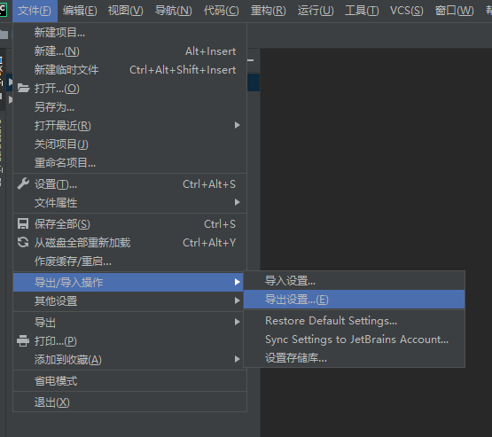

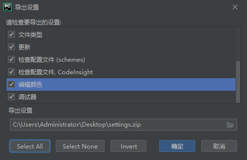

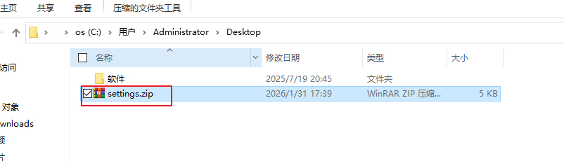

## 卸载程序

打开控制面板然后找到pycharm右击卸载

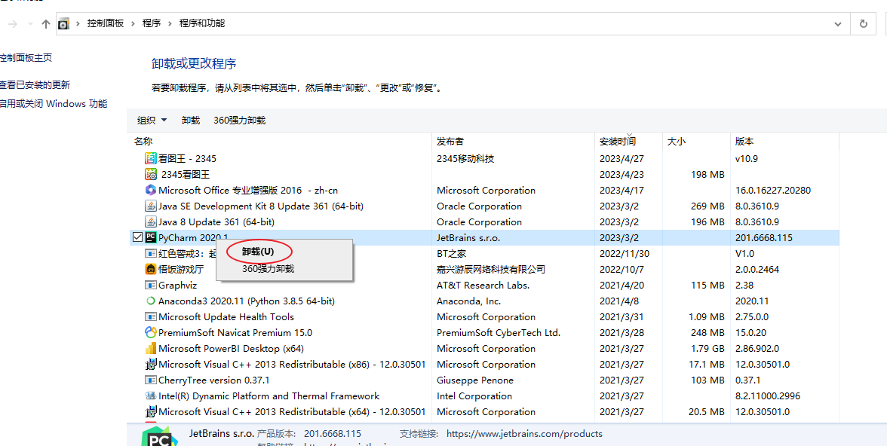

可以用微信翻译一下:说是要不要删除缓存和设置 1 删除缓存本地历史记录, 2.删除设置和已安装的插件

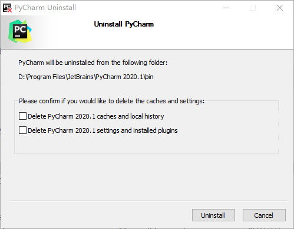

**注意**:卸载软件的时候要关闭软件不然会弹出对话框, 

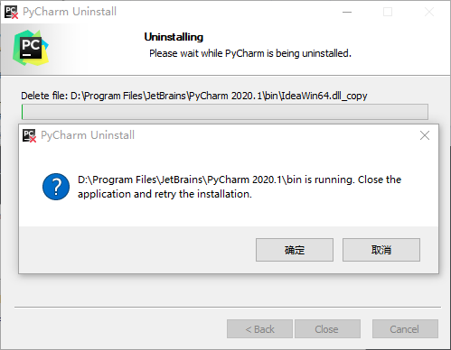

删除完成

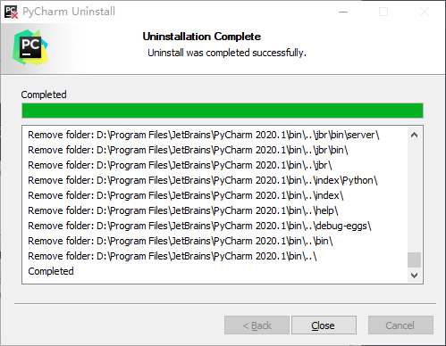

## 接下来是老三样下载破解

### 下载

接下来我打算去找2024版

下载地址: https://www.jetbrains.com/zh-cn/pycharm/download/other/#releases-2024

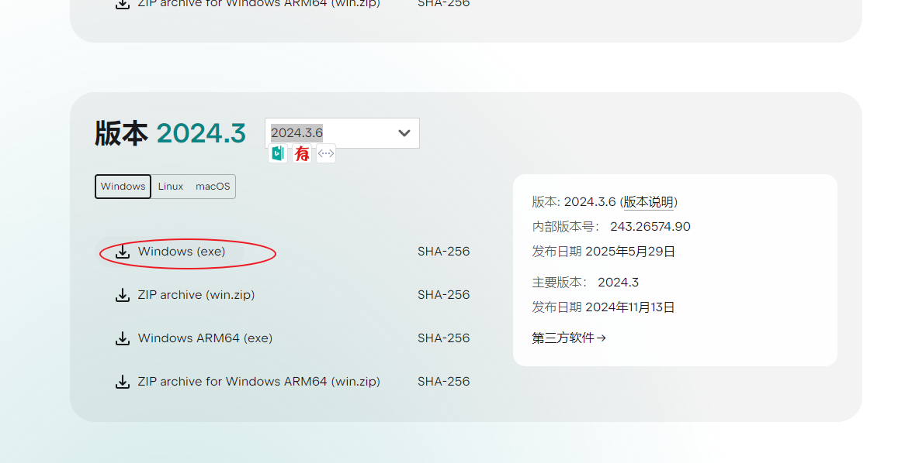

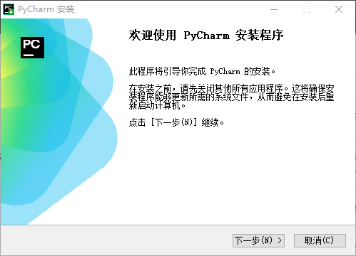

个人倾向于安装到D盘

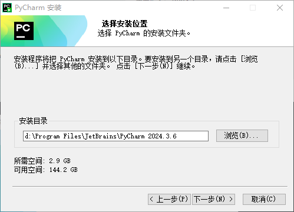

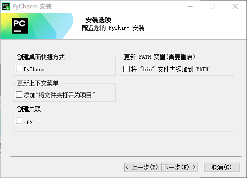

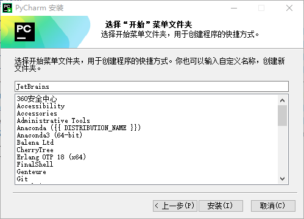

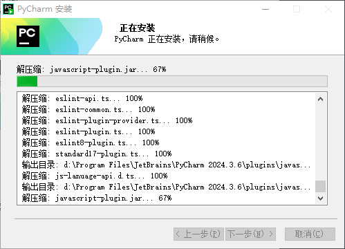

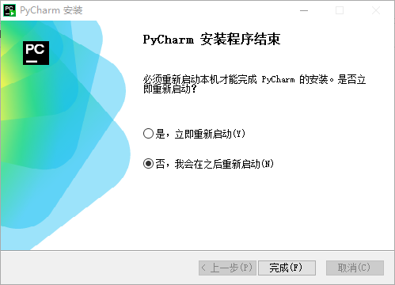

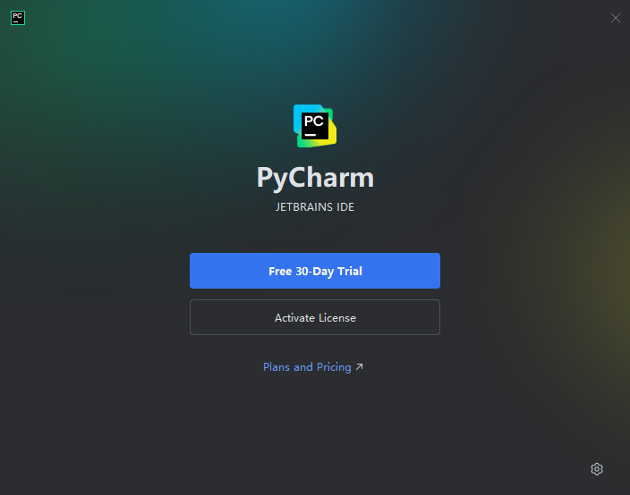

如果运行报错了那要检查一下注册表以及环境配置,

### 破解

破解软件的下载地址 https://pan.baidu.com/s/1yI02jNWaDiF8j3GnBOpHlA?pwd=97ac

另一个下载地址 https://pan.baidu.com/s/1u38ucZnTKW3EAEnvTIsLBg?pwd=6tt2

下载完是个压缩包,然后运行

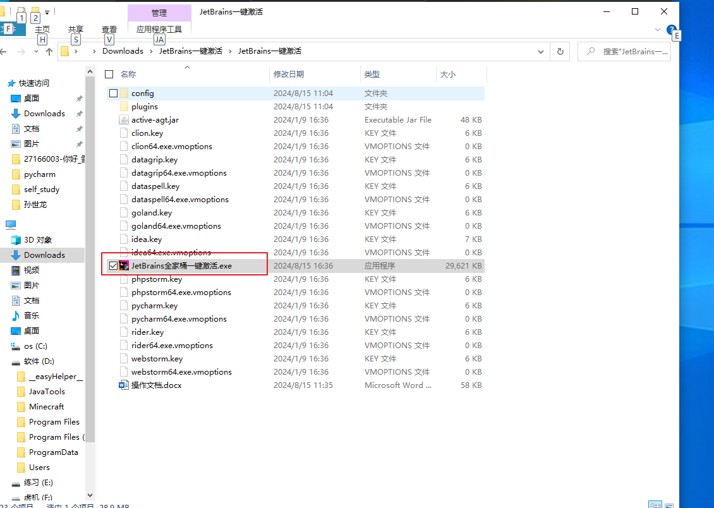

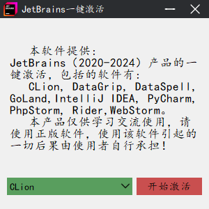

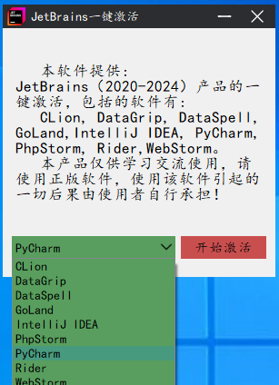

直接点开始激活就行

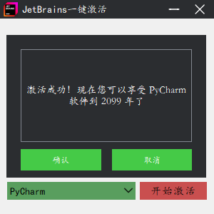

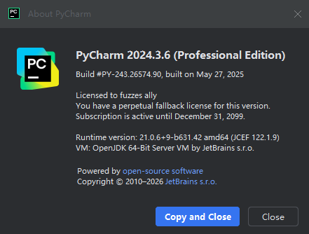

**激活失败**: 删除这个文件,  关闭软件重新激活

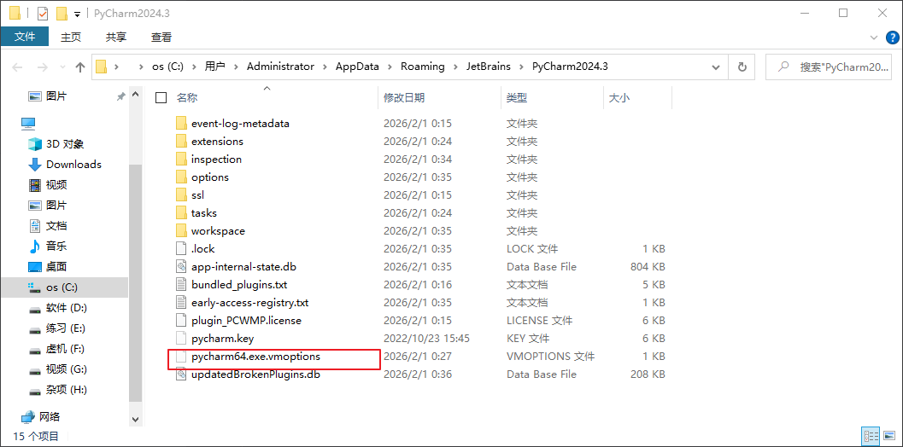

# 参考链接

[2024 PyCharm最新一键激活教程、破解教程，一键激活jetBrains全家桶](https://www.bilibili.com/video/BV1V3pUegEPH/?spm_id_from=333.337.search-card.all.click)

[🔥2024pycharm最新激活方法 - 努力奋进 - 博客园](https://www.cnblogs.com/mxcl/p/18734075)

[在 pycharm 2024版本出现 We could not validate your license 的解决办法-CSDN博客](https://blog.csdn.net/m0_46417790/article/details/141962826)