#     机顶盒刷成 liunx系统-Armbian

## 前言

手里闲置一个机顶盒, 中兴zvx10b860av2.1 然后自己上网查了一下, 其性能还能搭建一个小型的服务器, 闲来无事搞搞看看, 说不定还能部署一个什么博客或者个人网站之类的. Armbian 这个系统之前不了解只是在刷系统之后才逐步清楚的什么. 

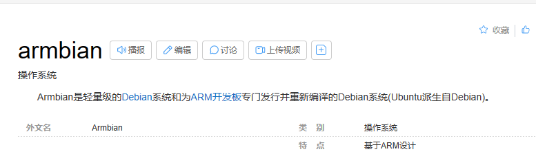

## 准备

其实早就刷过了已经做成功, 但有不足( 后面会说 ), 某一天想起来这个过程可以记录一下.

硬件

- 双USB线: 这是为了刷机用
- 电视盒子本体 包括了遥控, 网线之类的东西
- 笔记本电脑一台
- 便捷显示器
- 优盘 2.0 32G:  作为 Armbian 系统盘

软件 (有一些不合适或者失败的系统镜像或软件这里没有列出)

- USB_Burning_Tool: 用于为电视盒子烧写安卓系统
- balenaEtcher: 将Armbian系统写入 U盘
- DiskGenius: 用来调整u盘的分区大小
- 开心电视助手: 盒子中安卓系统安装软件
- android_tv_mgv2000-s905l2-android4.4.2-root:  用于刷机的安卓系统
- Armbian_5.44_S9xxx_Ubuntu_xenial_3.14.29_server_20180515: Armbian 系统
- meson-gxl-s905x-p212.dtb 我也并不太清楚这玩意干啥的总之和系统启动相关

盒子的一些图片:


这个电视盒子是已经退网的所以所有节目都看不了


CPU是ARM的虽然我不知道这是什么架构

- 四核处理器
- 1G内存
- 8G存储空间( 貌似是两个司机我这不太清楚 )
- 有无线


## 刷机过程 

1. 打开烧录软件 USB_Burning_Tool: 选择文件导入烧录 android_tv_mgv2000-s905l2-android4.4.2-root

   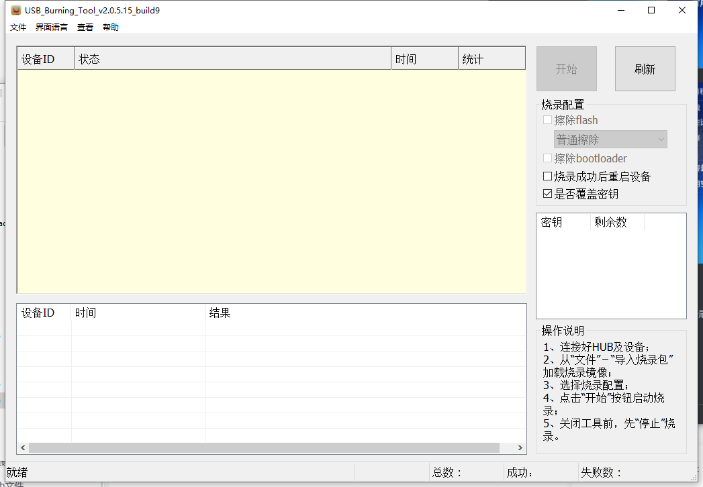

   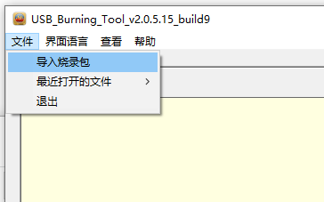

2. 在下载软件下方的状态栏中能看到导入包的路径

   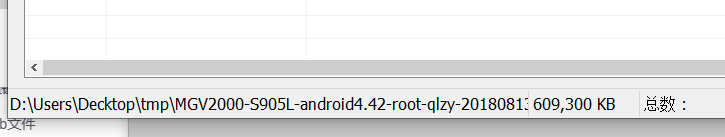
   
3. 用双头USB 连接机顶盒( 选择靠近网口的那一个USB )和电脑( 电脑的USB接口要用2.0 ). 此时不要连接机顶盒的电源, 用那个镊子或者是金属物品去短接一下机顶盒主板后面的C125触点( 这里我没照片图片, 最下面有我之前访问过的网站第一个里面就有图片 ), 短接触点的同时去连接电源.

4. 烧录软件此时可能会有连接信息, 有连接失败的可能从来就拔掉所有连线再来一遍.

   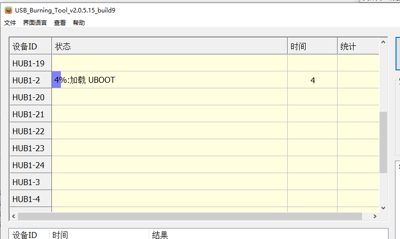

5. 烧录软件显示 100%烧录成功 后拔掉所有连线重启盒子即可

   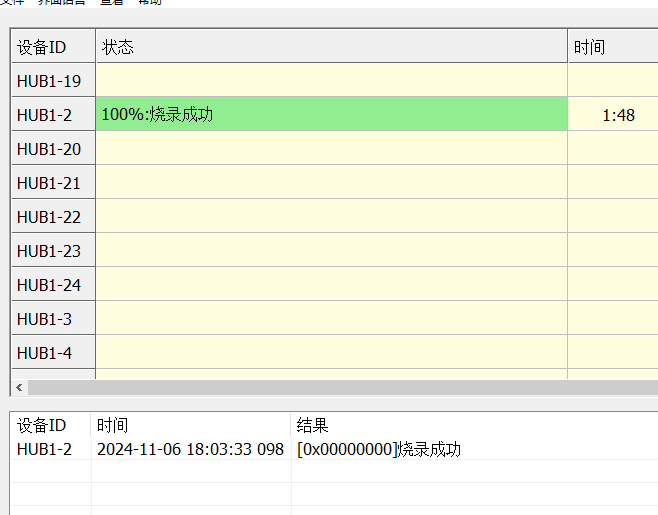

6. 盒子开机之后去连上网络, 查看一下IP地址 设置 -> 系统设置 -> 网络设置 -> 有线网络, 使用使用开心电视助手连接盒子, 盒子这里是准备完成了.

   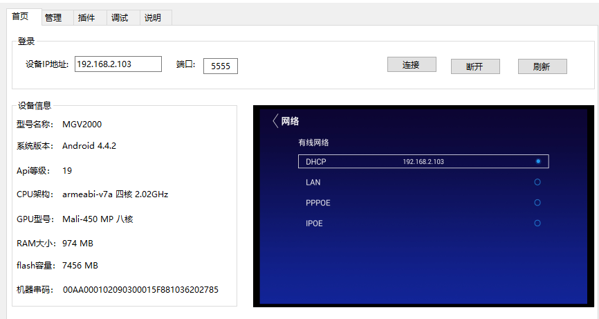

7. 制作 Armbian 系统u盘, 插入u盘 打开 balenaEtcher 导入镜像包Armbian_24.11.0_amlogic_s905l-mg101_bullseye_6.6.53_server_2024.10.02.img.gz, 等软件写入成功后, 拔下u盘.

   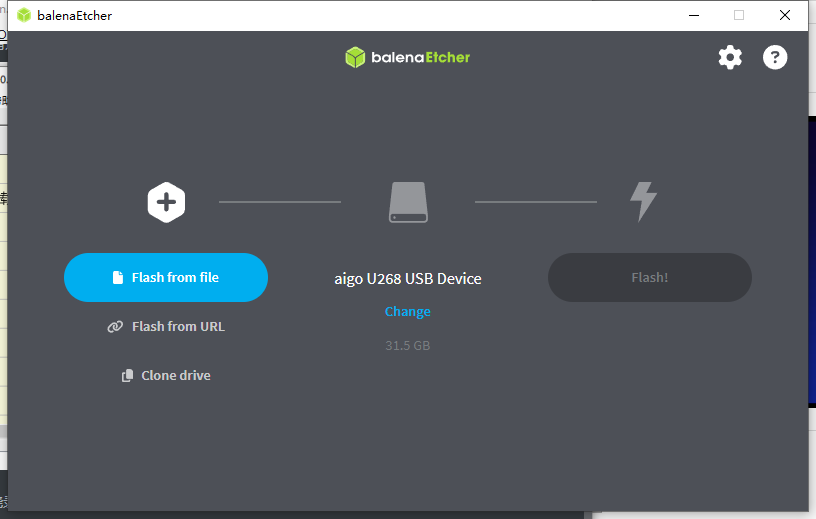

   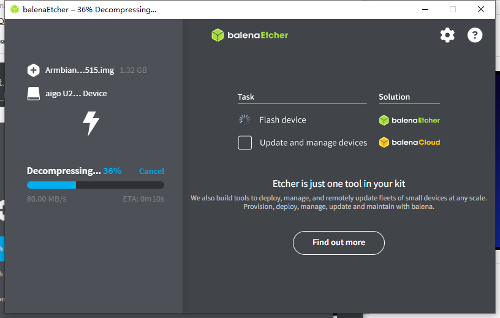

   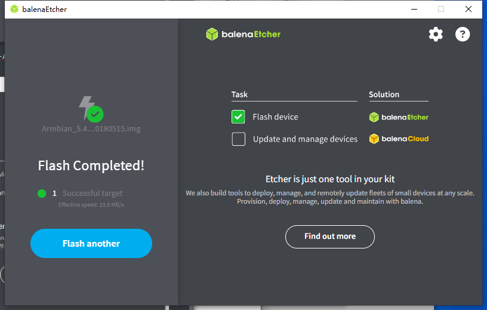

8. 重新插入U盘然后找到 uEnv.ini 将其内容改成下面这个 ( 其实接下来8 9 10的操作是不用做的也不影响系统 )

   ```sh
   LINUX=/zImage
   INITRD=/uInitrd
   #FDT=/meson-gxl-s905x-p212.dtb
   FDT=/dtb/amlogic/meson-gxl-s905x-p212.dtb
   APPEND=root=LABEL=ROOTFS_EMMC rootflags=data=writeback rw rootfstype=ext4 console=ttyAML0,115200n8 console=tty0 no_console_suspend consoleblank=0 fsck.fix=yes fsck.repair=yes net.ifnames=0 cgroup_enable=cpuset cgroup_memory=1 cgroup_enable=memory swapaccount=1
   ```

9. meson-gxl-s905x-p212.dtb 复制到 /dtb/amlogic中,  与上一步的文件中 FDT=/dtb/amlogic/meson-gxl-s905x-p212.dtb 保持一样

   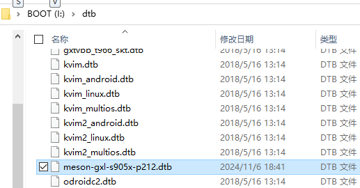

10. 调整分区大小, 打开 DiskeGenius,  在左侧找到U盘, 在上方的 ROOTFS 分区右击 - 调整分区大小

   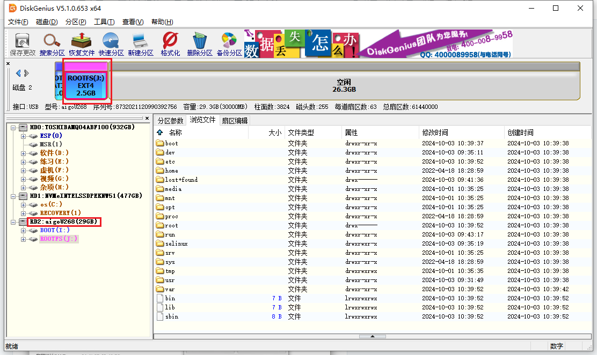

   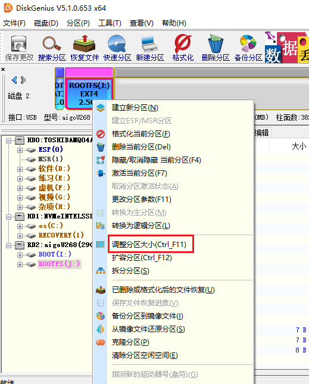

11. 将鼠标放在如图所指的位置鼠标形状会变成横着的左右拖动. 用以重新调整容量.然后点击 开始

   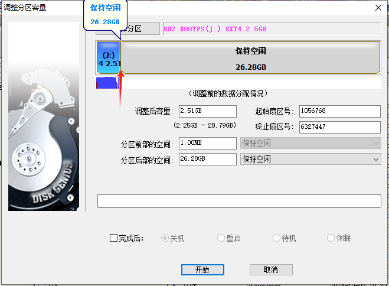

12. 然后弹出对话框等待操作完成后点击 - 完成

   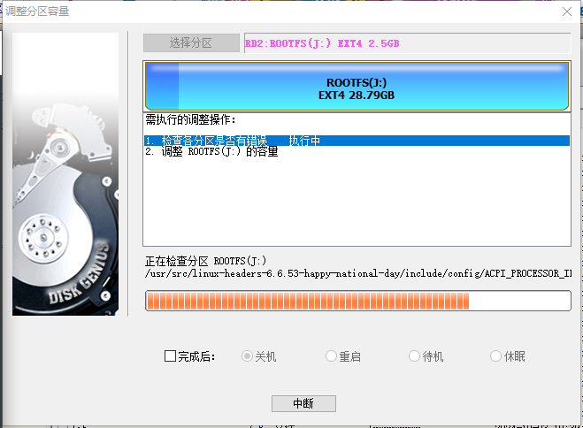

   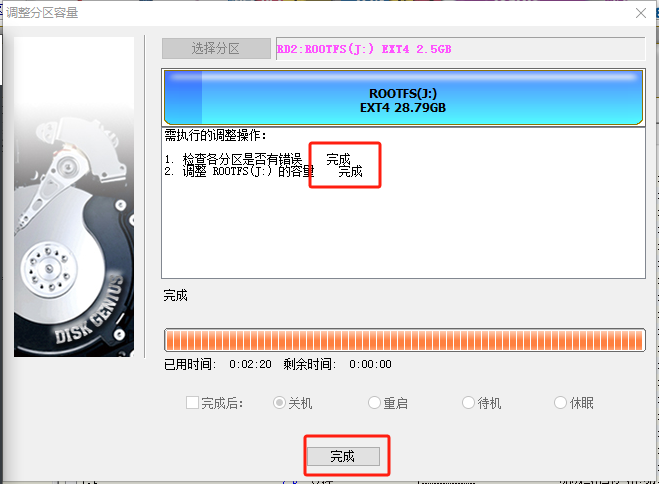

13. 开心电视助手选择调试标签 - 线刷模式. 黑屏之后U盘插入靠近盒子网口的USB (不要提前插入) 

   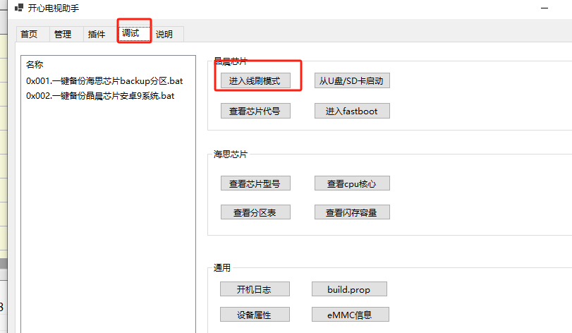

14. 接下来盒子会进行重启会显示一个IP地址, (记下IP地址) 用远程工具连接( 这里使用的是 cmd 里的 ssh, 需要提前安装 ).用户名是root, 初始密码是 1234, 打开cmd输入下面的内容 ( IP地址输入刚才记下的 ) 

    ```sh
    ssh root@192.168.2.103
    ```

15. 系统第一次连接都会询问是否接受密钥 直接输入yes回车即可, 有张画面没来得及截图, 是一闪而过的系统界面欢迎界面, 系统安装完每次重启都会看到,

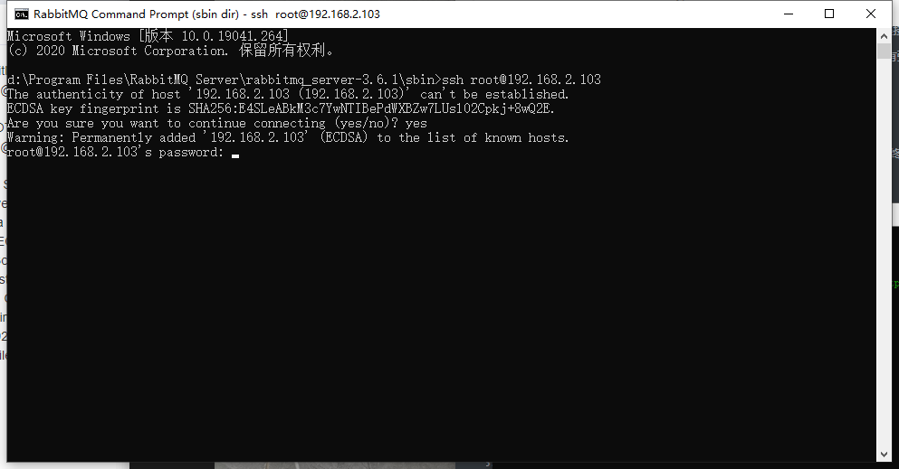

15. 如果一切正常的话最终会显示以下界面, 然后重新设置密码, 选择系统终端运行的shell 这里选的 1 

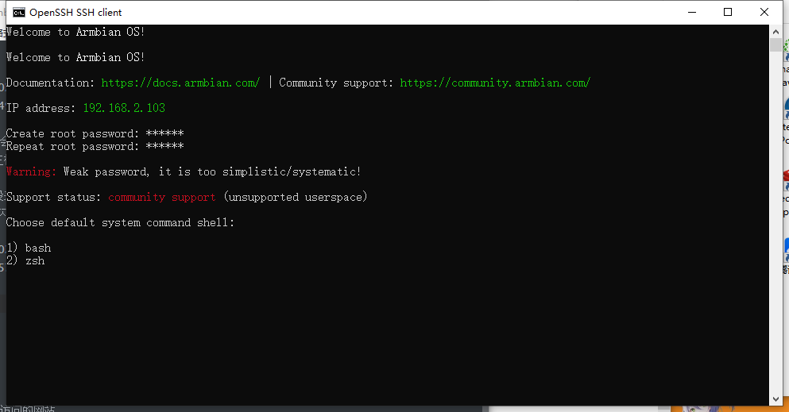

16. 接下来就是设置普通用户普通用户密码以及用户组, 用户组的名称是自动填入的直接回车就行

    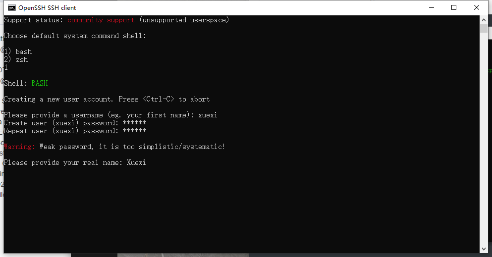

17. 然后就是设置时区和字符集, 时区默认是上海之间按 Y 回车, 字符集选择 5 回车

    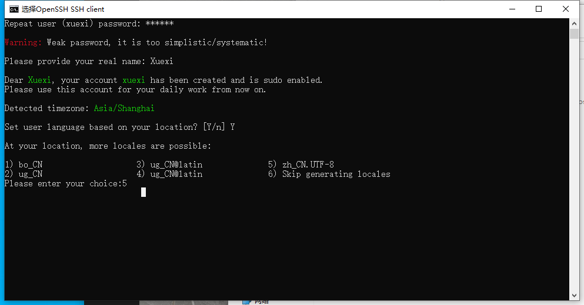

18. 字符集设置完系统后可能会卡一下等待即可, 然后就能看到欢迎页面, 系统就安装完了. 

    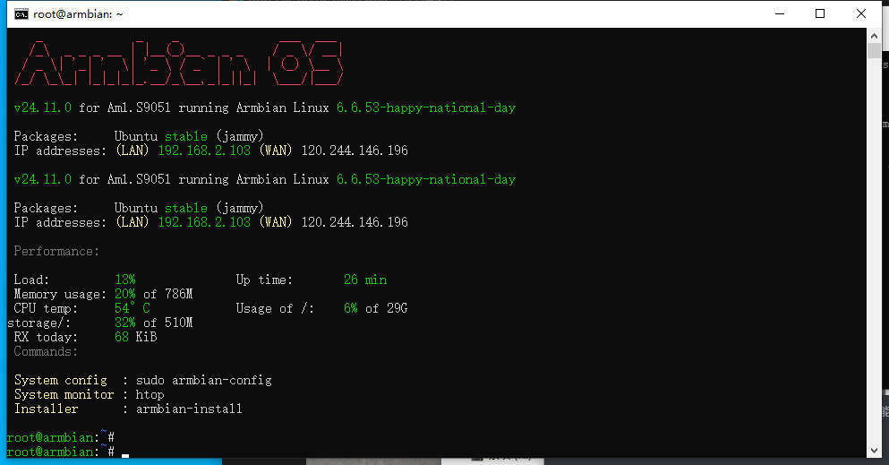

## 不足

1. 机顶盒是中兴的, 我也有中兴的安卓刷机包, 但是中兴的系统无法从U盘启动, 也就是说无法启动 Armbian. 之后是换了一个别的安卓系统, 可以从U盘启动了. 

2. 由于是换了别的安卓系统, 无线功能就有毛病了, 就是连着有线的情况下才能打开无线功能. 之后就可以把有线拔了, 重启之后无线功能又不能用了.

3. Armbian 中无线网无法使用, 因为内核是 6.6 , 缺少无线驱动. 自己试用官网的方法打驱动也无法启动无线功能. 更换低版本内核的镜像文件当然是发现U盘又不能启动, 这方面好像要涉及嵌入式的知识, 但我不会嵌入式.

4.  因为机顶盒原生的配置并不高, 所以安装桌面环境里会特别的卡, 系统在刚安装完情况下都用了162M的内存, 总内存是787M

   

## 参考的网站

1. [ZTE B860AV2.1 折腾 Armbian - huggy's blog](https://blog.huggy.moe/posts/2022/15-b860av2.1-armbian/)
2. [中兴电视盒子中兴B860AV2.1刷Armbian新手级教程-CSDN博客](https://blog.csdn.net/qq_27076243/article/details/139884785)
3. https://www.bilibili.com/video/BV1Aa4y1N7F1/?spm_id_from=333.337.search-card.all.click
4. [Search (realtek.com)](https://www.realtek.com/Home/Search?keyword=8189ftv&searchFrom=global)
5. [Realtek RTL8189FTV WLAN网络SDIO接口控制器模块的详细资料免费下载-电子电路图,电子技术资料网站 (elecfans.com)](https://www.elecfans.com/soft/interface/2018/20180901755244.html)
6. [RTL8189FTV驱动交叉编译_h5 rtl8189ftv-CSDN博客](https://blog.csdn.net/u011003120/article/details/90200176)
7. [S905/S905X Armbian安装WiFi驱动8189ETV的解决方法 - 橘子国王 - 博客园 (cnblogs.com)](https://www.cnblogs.com/jzgw/p/S905_8189ETV_8189ES_wifi-config.html)
8. [Linux安装无线网卡驱动通用方法 - 轶哥 (wyr.me)](https://www.wyr.me/post/623##toc2-1)
9. [【2021.03.07】Armbian 20.11 自编译 ubuntu 20.04 (已开源)-斐讯无线路由器以及其它斐迅网络设备-恩山无线论坛 (right.com.cn)](https://www.right.com.cn/FORUM/forum.php?mod=viewthread&tid=4053939&page=1)
10. [ophub/amlogic-s9xxx-armbian: Support for Armbian in Amlogic, Rockchip and Allwinner boxes. Support a311d, s922x, s905x3, s905x2, s912, s905d, s905x, s905w, s905, s905l, rk3588, rk3568, rk3399, rk3328, h6, etc. (github.com)](https://github.com/ophub/amlogic-s9xxx-armbian)
11. [中兴盒子，cpu s905l，板载无线realtek 8189ftv，有线正常，无线无法使用，请教解决办法 · Issue #640 · ophub/amlogic-s9xxx-armbian (github.com)](https://github.com/ophub/amlogic-s9xxx-armbian/issues/640)
12. [jwrdegoede/rtl8189ES_linux at rtl8189fs (github.com)](https://github.com/jwrdegoede/rtl8189ES_linux/tree/rtl8189fs)
13. [melsem/rtl8189es: ap ok (github.com)](https://github.com/melsem/rtl8189es)
14. [immortalwrt/package/kernel/rtl8189es at openwrt-18.06-k5.4 · immortalwrt/immortalwrt (github.com)](https://github.com/immortalwrt/immortalwrt/tree/openwrt-18.06-k5.4/package/kernel/rtl8189es)

日期 2024 11 07